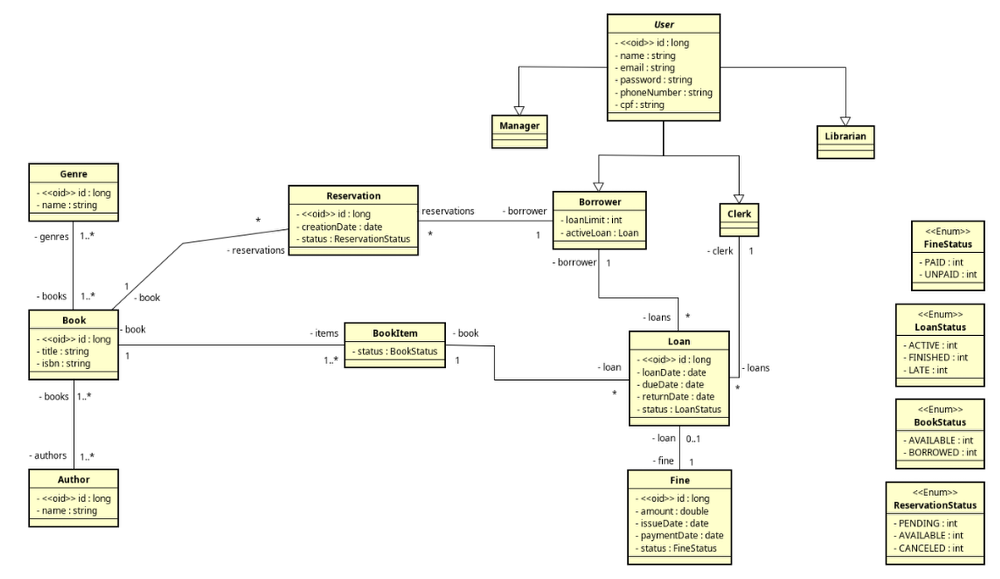

# Sistema de Gerenciamento de Biblioteca | Library Management System

[English](#english) | [Português](#português)

---

 

## 📖 Sistema de Gerenciamento de Biblioteca (Português)

### 📌 Sobre o Projeto

Este projeto é um **Sistema de Gerenciamento de Biblioteca** full-stack, desenvolvido como parte do meu portfólio pessoal. O objetivo é criar uma aplicação robusta, escalável e bem documentada, aplicando conceitos modernos de arquitetura de software, modelagem de domínio e boas práticas de desenvolvimento.

O sistema foi concebido para gerenciar o acervo de uma biblioteca, controlar o fluxo de empréstimos, devoluções, reservas e multas, além de gerenciar diferentes níveis de acesso para usuários.

---

### ✨ Funcionalidades

* **📚 Gerenciamento de Acervo:** CRUD completo para Livros, Autores, Gêneros e Exemplares individuais.
* **👤 Gestão de Usuários:** Múltiplos perfis com diferentes permissões (Leitor, Atendente, Bibliotecário e Gerente).
* **🔄 Fluxo de Empréstimo:** Sistema para registrar empréstimos e devoluções, com regras de negócio para limitar empréstimos por usuário.
* **📅 Sistema de Reservas:** Leitores podem entrar em uma fila de espera para livros que já estão emprestados.
* **💰 Cálculo de Multas:** Geração automática de multas para devoluções realizadas com atraso.
* **🔒 Autenticação e Autorização:** Sistema seguro baseado em tokens JWT.

---

### 🏛️ Arquitetura e Modelo de Domínio

O projeto foi iniciado com uma fase de modelagem de domínio, utilizando um **Diagrama de Classes UML** para garantir uma base coesa e bem estruturada. O diagrama define todas as entidades, seus atributos e relacionamentos, servindo como um guia para o desenvolvimento do backend.

---

### 🛠️ Tecnologias Utilizadas

| Categoria       | Tecnologia                                                    |
| --------------- | ------------------------------------------------------------- |
| **Backend** | `Java 17+`, `Spring Boot 3`, `Spring Data JPA`, `Spring Security` |
| **Frontend** | `Angular`, `TypeScript`, `HTML5`, `CSS3`                        |
| **Banco de Dados**| `PostgreSQL` (Produção), `H2` (Testes)                          |
| **Infra/DevOps**| `Docker`, `Docker Compose`                                    |
| **Autenticação**| `JSON Web Tokens (JWT)`                                       |
| **Build Tool** | `Maven`                                                       |

---

### 👨‍💻 Autor

Feito com ❤️ por Gabriel Fonseca.

---

 

## 📖 Library Management System (English)

### 📌 About The Project

This project is a full-stack **Library Management System**, developed as a personal portfolio piece. The goal is to build a robust, scalable, and well-documented application, applying modern concepts of software architecture, domain modeling, and development best practices.

The system is designed to manage a library's catalog, control the flow of loans, returns, reservations, and fines, as well as manage different user access levels.

---

### ✨ Features

* **📚 Catalog Management:** Full CRUD for Books, Authors, Genres, and individual Book Items.
* **👤 User Management:** Multiple roles with different permissions (Borrower, Clerk, Librarian, and Manager).
* **🔄 Loan Workflow:** A system to register loans and returns, with business rules to limit loans per user.
* **📅 Reservation System:** Users can join a waiting list for books that are currently checked out.
* **💰 Fine Calculation:** Automatic fine generation for overdue returns.
* **🔒 Authentication & Authorization:** Secure system based on JWT tokens.

---

### 🏛️ Architecture and Domain Model

The project was initiated with a domain modeling phase, using a **UML Class Diagram** to ensure a cohesive and well-structured foundation. The diagram defines all entities, their attributes, and relationships, serving as a blueprint for backend development.

---

### 🛠️ Tech Stack

| Category      | Tecnology                                                    |
| --------------- | ------------------------------------------------------------- |
| **Backend** | `Java 17+`, `Spring Boot 3`, `Spring Data JPA`, `Spring Security` |
| **Frontend** | `Angular`, `TypeScript`, `HTML5`, `CSS3`                        |
| **Database**| `PostgreSQL` (Production), `H2` (Tests)                          |
| **Infra/DevOps**| `Docker`, `Docker Compose`                                    |
| **Authentication**| `JSON Web Tokens (JWT)`                                       |
| **Build Tool** | `Maven`                                                       |

---

### 👨‍💻 Author

Made with ❤️ by Gabriel Fonseca.
